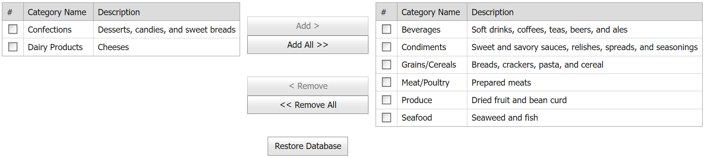

<!-- default badges list -->

[](https://supportcenter.devexpress.com/ticket/details/E2636)
[](https://docs.devexpress.com/GeneralInformation/403183)
<!-- default badges end -->
# Grid View for ASP.NET Web Forms - How to move selected rows between grid controls
<!-- run online -->
**[[Run Online]](https://codecentral.devexpress.com/e2636/)**
<!-- run online end -->

This example demonstrates how to move selected rows from one grid to another on a custom button click and update data sources on the server.



## Overview

Create two grid controls and add custom moving buttons to the page. Use the client-side [PerformCallback](https://docs.devexpress.com/AspNet/js-ASPxClientGridView.PerformCallback(args)) method to send custom callbacks to the server when a user clicks the corresponding button. Based on an action, create a command and pass it as a parameter.

```js
var command = null;
function AddSelectedRows() {
    command = 'addSelectedRows';
    UpdateTargetGrid();
}

function UpdateTargetGrid() {
    if (command != null)
        targetGrid.PerformCallback(command);
    else {
        targetGrid.Refresh();
    }
}
```

On the server, the `PerformCallback` method raises the [CustomCallback](https://docs.devexpress.com/AspNet/DevExpress.Web.ASPxGridView.CustomCallback) event. In the `CustomCallback` event handler, call the [GetSelectedFieldValues](https://docs.devexpress.com/AspNet/DevExpress.Web.ASPxGridBase.GetSelectedFieldValues(System.String--)) method to obtain the selected rows. Update the data sources of the grids based on the command passed to the server.

```cs
protected void TargetGrid_CustomCallback(object sender, DevExpress.Web.ASPxGridViewCustomCallbackEventArgs e) {
    rowValues = new List<object>();
    
    switch (e.Parameters) {
        case "addSelectedRows":
            rowValues = SourceGrid.GetSelectedFieldValues(fieldNames);
            var categoryIDs = new StringBuilder();
            for (int i = 0; i < rowValues.Count(); i++) {
                var categoryID = (rowValues[i] as object[])[0];
                if (i < rowValues.Count() - 1)
                    categoryIDs.AppendFormat("{0}, ", categoryID);
                else
                    categoryIDs.Append(categoryID);
            }
            if (categoryIDs.Length > 0) {
                SourceDS.DeleteCommand = string.Format("DELETE FROM [Categories] WHERE [CategoryID] IN ({0})", categoryIDs);
                SourceDS.Delete();
                
                foreach (object[] rowValue in rowValues) {
                    TargetDS.InsertCommand = string.Format(
                        "INSERT INTO [CategoriesUpdated] ([CategoryID], [CategoryName], [Description]) VALUES ({0}, '{1}', '{2}')", 
                        rowValue[0], rowValue[1], rowValue[2]);
                    TargetDS.Insert();
                }
                TargetGrid.DataBind();
            }
            break;
        // ...
    }
}
```

## Files to Review

* [Default.aspx](./CS/E2636/Default.aspx) (VB: [Default.aspx](./VB/E2636/Default.aspx))
* [Default.aspx.cs](./CS/E2636/Default.aspx.cs) (VB: [Default.aspx.vb](./VB/E2636/Default.aspx.vb))

## Documentation

* [Grid Selection](https://docs.devexpress.com/AspNet/3737/components/grid-view/concepts/focus-and-navigation/selection)

## More Examples

* [Grid View for ASP.NET Web Forms - How to Delete Selected Rows in a Grid](https://github.com/DevExpress-Examples/aspxgridview-delete-selected-rows)
* [Grid View for ASP.NET MVC - How to copy selected rows from one grid to another in batch edit mode](https://github.com/DevExpress-Examples/gridview-how-to-copy-selected-rows-from-one-grid-to-another-one-in-batch-edit-mode-t466784)
